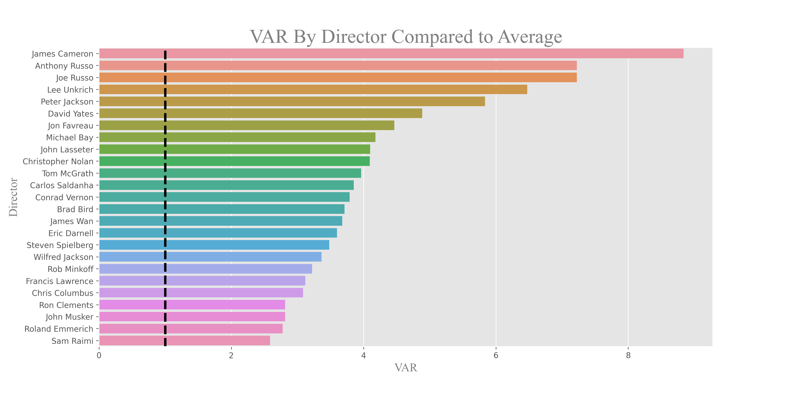
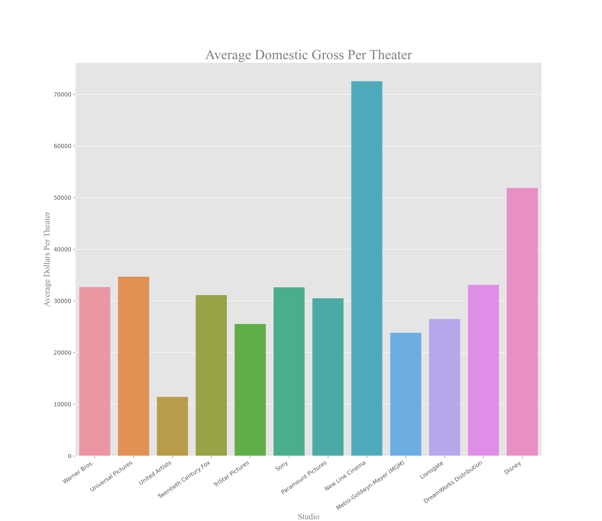

# Project Overview

*Our hypothetical Company has announced that they would like to get into the movie industry. They will be creating a studio, however they have no knowledge of the movie industry. My goal is to collect, clean, and analyze movie data from a variety of sources so that I can provide recommendations to the company that will allow them to be successful in the movie industry.*


## Python Libaries Used
### *pandas, numpy, seaborn, matplotlip, datetime*

## Data and Exploration
### Web-scrapping<br />

The web-scraped data used in this project was collected from the following sources:

1. https://www.the-numbers.com/movie/budgets/all/1
2. https://www.imdb.com/search/title/?title_type=feature&num_votes=5000,&languages=en&sort=boxoffice_gross_us,desc&start=1&explore=genres&ref_=adv_nx
3. https://www.boxofficemojo.com/chart/most_theaters/?by_studio_type=major
4. https://www.moviefone.com/movies/2019/?page=1
5. https://en.wikipedia.org/wiki/List_of_Academy_Award-winning_films

### Exploration Questions <br />

In my analysis I explore and answer the following questions:

1. What are the most profitable movies and how much should you spend?
2. Which movie genres are most commonly produced and does quantity equate to higher net profits?
3. What is the best time of the year to release a movie?
4. Which actors and directors tend to add the most value?
5. How much money should you spend to win an Oscar?
6. What impact, if any, does runtime and movie rating have on Net Profit, Profit Margin and IMDb rating?
7. Sticking to our analysis of Net Profit and Profit Margin, what should our Company determine to be the baseline for sustainable success?
8. Based on the success of current competitors, which should we look to for best practices?

## Question 1: What are the most profitable movies and how much should you spend?

To answer this question and provide a recommendation we'll make use of a budgets dataframe called `imdb_budgets_df`. Our analysis will require that we use the data to calculate profit and profit margin.

```
imdb_budgets_df['Profit'] = imdb_budgets_df['Worldwide Gross'] - imdb_budgets_df['Production Budget']

imdb_budgets_df['Profit_Margin'] = (imdb_budgets_df['Worldwide Gross'] - 
                                    imdb_budgets_df['Production Budget'])/imdb_budgets_df['Worldwide Gross']
```

We will also create two columns called `Adjusted_Budget` and `Adjusted_Profit` where we recalculate a movie's budget and profit to account for inflation and allow us to perform analysis based on the value of the 2020 dollar.

We examine the overall trend of budget versus profit to see if there's any correlation.


We also take a look at the top 25 movies in terms of profit to understand their financial success and how closely we should attempt to emulate their budget. We can see in the graph below there are a few outliers so the median will end up being more useful in determining our final budget.


**Question 1 Conclusion:** Our Company should budget \$82,250,000 for a movie and that budget should correlate with a profit margin of 80\%.

## Question 2: Which movie genres are most commonly produced and does quantity equate to higher net profits?

We first count the number of movies in each genre and plot those results on a bar graph.
```
m_by_genre = genre_budgets_df.groupby('Genre', as_index=False)['Movie'].count().sort_values(by='Movie', ascending=False)
```
Using the same `groupby` method, we select the median net profit and profit margin for each genre. We use the median in this case as the mean is likely skewed by outliers. Outliers could either be movies with enormous profits or movies having negative profit.


Lastly, we look at the percent of net profit by genre. This informs us as to how Our Company should allocate their movie budget to various films.

**Question 2 Conclusion:** Animation, adventure, and sci-Fi have the highest net profit of all genres. Analysis of profit margin shows that in addition animation, adventure, and sci-fi, horrors and musicals also have financial success.

## Question 3: What is the best time of the year to release a movie?

We start by converting the dates from the `imdb_budgets_df` dataframe to a datetime object.  We then do a count by month to see the number of movies released in each month.

When grouping by month, we can select the `Net Profit` and `Profit Margin` columns so that we can see which months have the most financial success.


Finally we plot the net profit by month for a small selection of genres.  We can see that there is a general trend amongst these genres for the profit in each month.


**Question 3 Conclusion:** We recommend that Our Company release the bulk of their movies, especially Animation, during the summer months (i.e. May-July). Adventure, Drama and Comedy movies would see similar success if released in November, but the recommendation remains to focus on summer.

## Question 4: Which actors and directors tend to add the most value?

In this section we are going to take a look at the average net profit across all movies. From there we want to determine which actors and directors consistently appear in movies where the net profit substantially exceeds the average. We will represent this in a field called Value Above Replacement(VAR). To further simplify this concept; if across all movies the average net profit is 100 dollars and the average net profit of movies from 'Actor: X' is 200 dollars he/she would have a VAR of 2. This number represents X times over the average. To eliminate outliers we will look at actors who appear in 10 or more movies and directors who work in 5 or more.

We'll use the `actors_df` dataframe, adjust for inflation, and calculate profit as we did in Question 1. Then filter by actors who have starred in 10 or more movies.

```
actor_counts = actors_df['value'].value_counts()
actor_list = actor_counts[actor_counts >= 10].index.tolist()
actors_df = actors_df[actors_df['value'].isin(actor_list)]
```

To calculate VAR:
```
actor_total = actors_df.groupby(['value'],  as_index=False)['Net Profit'].mean().sort_values(by='Net Profit', ascending=False)
actor_total['VAR'] = (actor_total['Net Profit']/actor_total['Net Profit'].mean())
```
We follow the same process with directors, except we filter by using 5 or more movies instead of 10.





**Question 4 Conclusion:** We recommend that Our Company focus their cast and crew search to individuals who consistently score at least 1.0 on the VAR score. We can, with a high level of confidence, conclude that these individuals will elevate the overall production.

## Question 5: How much money should you spend on a movie to win an Oscar?

In this analysis we will join the `imdb_budgets_df` and `awards_df` dataframes so that we explore correlations between budgets and Oscar wins. We first look at a distribution of the budget for movies that have been Oscar-nominated.  We also look at the win rates for the nominated movies so that we can establish the minimum number of nominations required to secure at least one win. For this analysis the minimum number or nominations 
required was three.


We use three nominations as the cutoff to filter our data and then look at the distribution of budgets again. We use the median as our measure of central tendency due to a large standard deviation in the data.


**Question 5 Conclusion:** Our Company should spend at least $35,465,000 in order to make an Oscar-winning movie.

## Question 6: What impact, if any, does runtime and movie rating have on Net Profit, Profit Margin and IMDb rating?

To answer this question we will only focus on the 4 ratings: G, PG, PG-13, and R. We then count the ratings to see how many movies fall within each category.  From there we can examine the net profit and profit margin of genre to see which has the most financial success.

It's also important to see the net profits of each rating by genre. We first do a `groupby` on rating and genre and then create a pivot table so that we can see the net profits of each rating in each genre.  This will guide us as to what ratings should be targeted based on the genre of the movie being made.


**Question 6 Conclusion:** We recommend that Microsoft take into consideration the rating of the movie based on the genre and target audience. If making animation movies, it is wise to stick to a G or PG rating, otherwise PG-13 is the sweetspot. In terms of runtime, there is little correlation in terms of overall profitability.

## Question 7: Sticking to our analysis of Net Profit and Profit Margin, what should Microsoft determine to be the baseline for sustainable success?

This analysis will require the use of the `studiobudgets_df dataframe`.  We first drop non-pertinent rows so that we can just focus on the studio performance. As we've done with other analyses, we use `groupby` and select the median as the primary measure of central tendency.
We only select the top 25 studios as we are concerned with both being financial successful as well as being recognized as one of the major studios in the industry.


**Question 7 Conclusion:** Our Company should aim for a profit margin of 66% and a net profit of slightly over 50 million per movie to compete with the top existing studios.

## Question 8: Based on the success of current competitors, which should we look to for best practices?

We take the `theaters_df` dataframe and a column called `dollars_per_theater` to see what the average domestic gross per theater is for a movie.  We then `groupby` by studio so that we can compare each studio.




We also investigate the correlation between the average maximum number of theaters and average domestic gross per studio.


We perform a join between the `theaters_df` and `awards_df` dataframes to further explore this question.
```
theaters_df.set_index(['title', 'year'], inplace=True)
theaters_and_awards = theaters_df.join(awards_df, how='inner', on=['title', 'year'])
```

The joining only leaves us with 66 movies upon which to draw conclusions.  That is not ideal, but two studios - Disney and Warner Bros. - stand out among the rest as they have 22 and 15 of the movies in this dataframe, respectively. This is more than double any other studio.  We then compare 
their average domestic gross per theater and win rate to see which of the two has performed better.


**Question 8 Conclusion:** Our Company should look towards Disney based upon domestic gross per theater and win rate. This means that Our Company should on average target for a movie to be in a maxium of 3818 theaters at its peak. 


